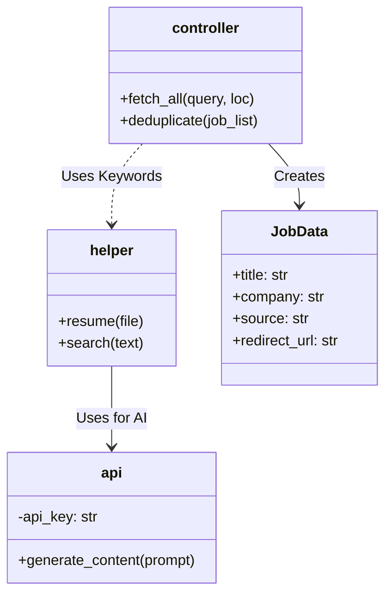

```mermaid
classDiagram
    class helper {
        +resume(file)
        +search(text)
    }
    class controller {
        +fetch_all(query, loc)
        +deduplicate(job_list)
    }
    class api {
        -api_key: str
        +generate_content(prompt)
    }
    class JobData {
        +title: str
        +company: str
        +source: str
        +redirect_url: str
    }

    helper --> api : Uses for AI
    controller --> JobData : Creates
    controller ..> helper : Uses Keywords
```