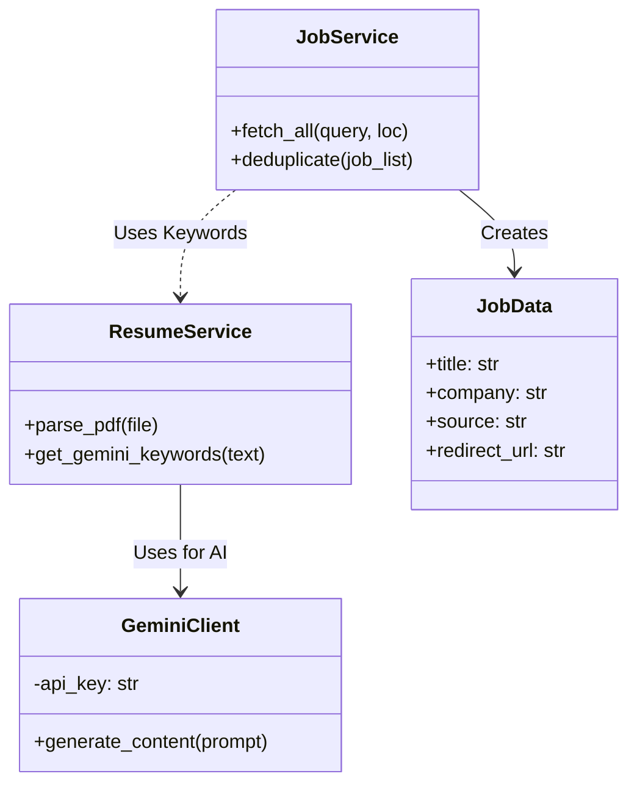

```mermaid
classDiagram
    class ResumeService {
        +parse_pdf(file)
        +get_gemini_keywords(text)
    }
    class JobService {
        +fetch_all(query, loc)
        +deduplicate(job_list)
    }
    class GeminiClient {
        -api_key: str
        +generate_content(prompt)
    }
    class JobData {
        +title: str
        +company: str
        +source: str
        +redirect_url: str
    }

    ResumeService --> GeminiClient : Uses for AI
    JobService --> JobData : Creates
    JobService ..> ResumeService : Uses Keywords
```