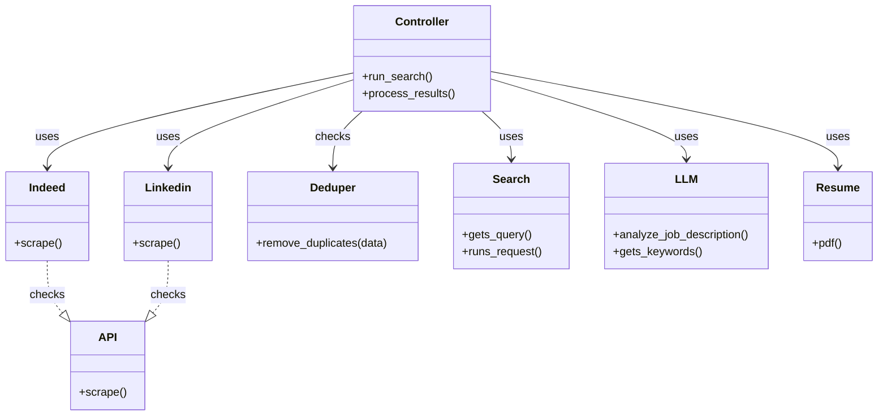

```mermaid
classDiagram
    class Controller {
        +run_search()
        +process_results()
    }

    class API {
        +scrape()
    }

    class Indeed {
        +scrape()
    }

    class Linkedin {
        +scrape()
    }

    class Deduper {
        +remove_duplicates(data)
    }

    class Search {
        +gets_query()
        +runs_request()
    }

    class LLM {
        +analyze_job_description()
        +gets_keywords()
    }

    class Resume {
        +pdf()
    }

    %% Relationships
    Controller --> Indeed : uses
    Controller --> Linkedin : uses
    Controller --> Deduper : checks
    Indeed ..|> API : checks
    Linkedin ..|> API : checks
    
    Controller --> Search : uses
    Controller --> LLM : uses
    Controller --> Resume : uses
```