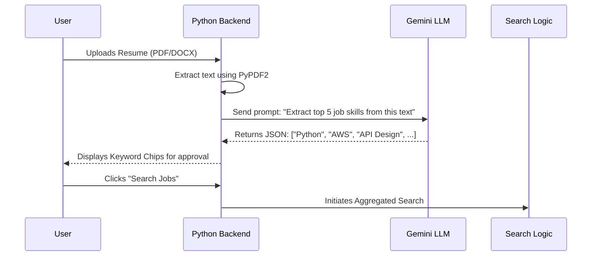

```mermaid
sequenceDiagram
    participant User
    participant FastAPI as Python Backend
    participant Gemini as Gemini LLM
    participant Search as Search Logic

    User->>FastAPI: Uploads Resume (PDF/DOCX)
    FastAPI->>FastAPI: Extract text using PyPDF2
    FastAPI->>Gemini: Send prompt: "Extract top 5 job skills from this text"
    Gemini-->>FastAPI: Returns JSON: ["Python", "AWS", "API Design", ...]
    FastAPI-->>User: Displays Keyword Chips for approval
    User->>FastAPI: Clicks "Search Jobs"
    FastAPI->>Search: Initiates Aggregated Search
```