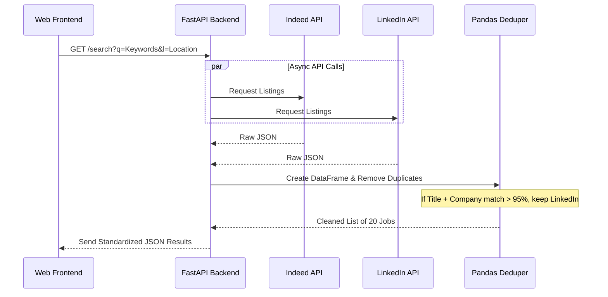

```mermaid
sequenceDiagram
    participant UI as Web Frontend
    participant API as FastAPI Backend
    participant Indeed as Indeed API
    participant LinkedIn as LinkedIn API
    participant Processor as Pandas Deduper

    UI->>API: GET /search?q=Keywords&l=Location
    
    par Async API Calls
        API->>Indeed: Request Listings
        API->>LinkedIn: Request Listings
    end

    Indeed-->>API: Raw JSON
    LinkedIn-->>API: Raw JSON
    
    API->>Processor: Create DataFrame & Remove Duplicates
    Note over Processor: If Title + Company match > 95%, keep LinkedIn
    
    Processor-->>API: Cleaned List of 20 Jobs
    API-->>UI: Send Standardized JSON Results
```